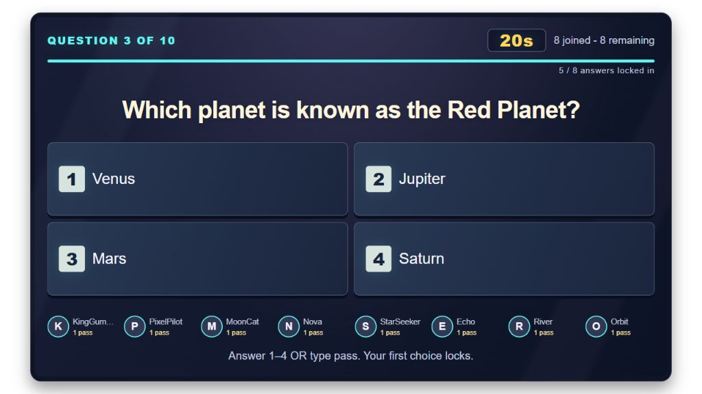
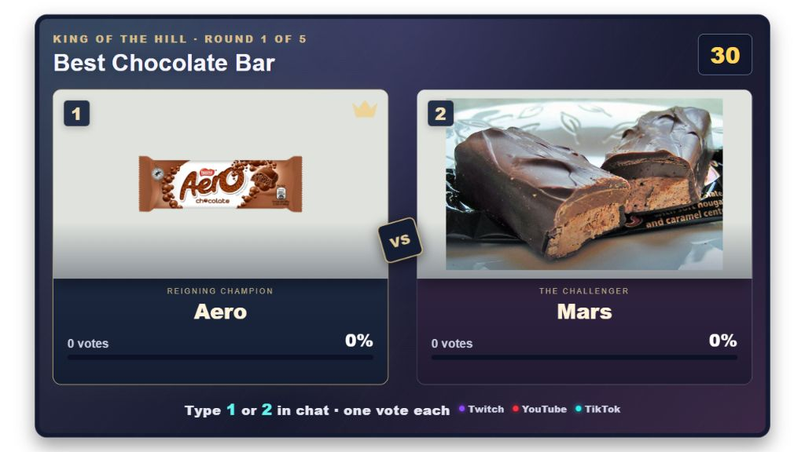
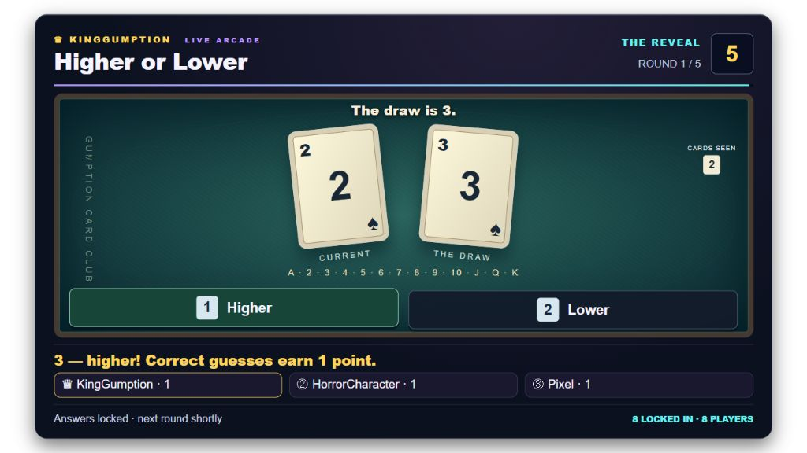
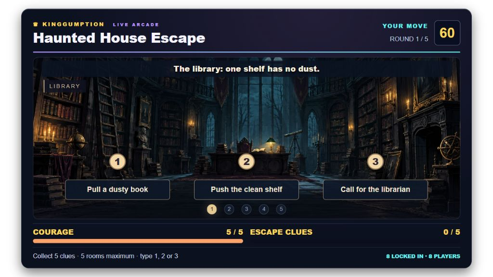
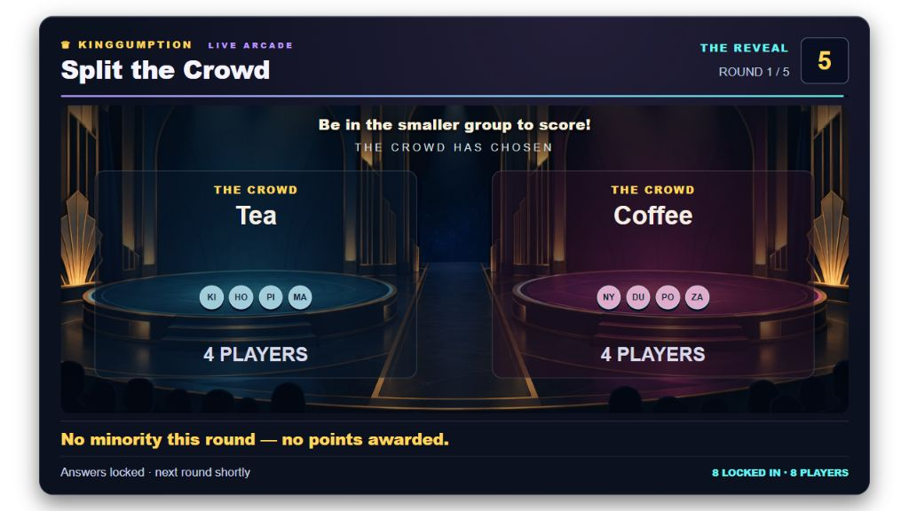
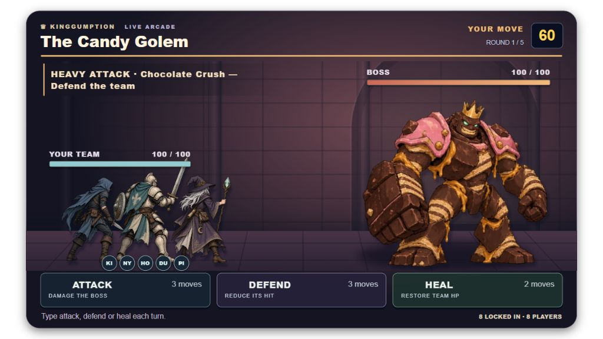
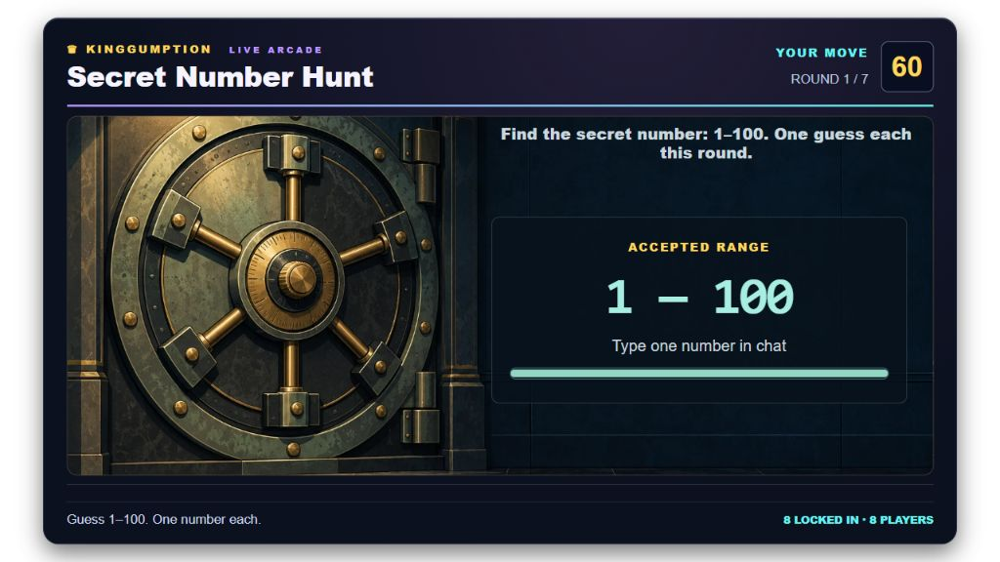
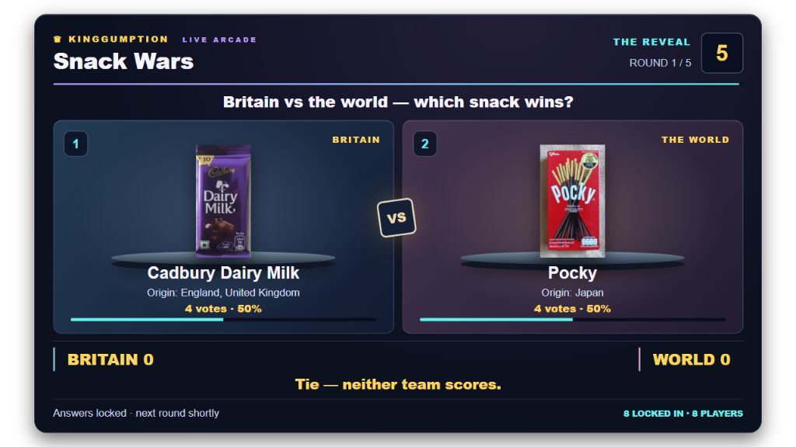

# Game review — 4 October 2026

This review covered all eight games, their chat input and timing, presentation, scoring, reconnect behaviour, asset coverage and sound-event handling. The changes below are implemented. The screenshots show the actual browser overlays using isolated deterministic game fixtures, not design mockups. Timers were frozen for capture and sample player names were used. No production round or viewer message was created for this review.

The shared 1080 × 640 OBS overlay remains the delivery format. Unity and a 3D modelling plugin are not required for these games. Browser rendering, carefully composed illustration, existing layered boss sprites and Web Audio fit the current controls and deployment much better than introducing a separate engine.

## 1. Quiz — clear and functional; crowded-name limits remain

The question and four chat choices remain the focus. The existing two-second grace period, first-answer lock, typed `pass`, saved bonus-pass rules, speed points and reveal podium are retained. Pass balances were hidden by a presentation override; they are now visible beneath each displayed name rather than squeezing into the same row. Long names deliberately truncate in the contestant rail; the reveal has more room. Existing pass-use recap and podium remain part of the results.

Sound now avoids accumulating old effects while the browser audio context is suspended. Tick and reveal voices use less abrasive waveforms. The existing quiz scoring, lifeline, view and sound tests pass. This is still a public-chat game: it cannot conceal another viewer's answer or detect when someone began typing. Arrival at the server within the grace window determines eligibility.

## 2. King of the Hill — catalogue and deadline defects corrected

The catalogue now covers all 570 answers and all 57 topic thumbnails with local files. The old coverage test explicitly skipped the 400 newer answers; that exception is removed. A separate image decoder audit checks actual file readability and source metadata. Topic previews and matchup artwork no longer depend on live third-party image requests.

The review checked contact sheets and corrected wrong subject matches as well as missing files: chocolate bars, Halloween treats/costumes, Baymax, Gandalf, Miss Marple, game weapons, Nintendo hardware and more. Real product and character references are retained; abstract powers have original stylised icons. Some broad subjects intentionally use contextual photographs, posters, logos or replicas rather than claiming to show a specific fictional location directly. Source information is in the manifest.

Images now fit inside their cards without cropping packaging or faces. There is a readable failure fallback. Topic and battle votes receive a two-second last call; a late packet cannot become a vote for the next round. Existing tie, round and analytics behaviour remains tested. The catalogue is complete, although its source photography naturally varies in composition.

## 3. Higher or Lower — rules now match the cards

57 was possible under the old 1–100 number rules, but displaying it on a conventional playing card made the game misleading. The game now uses A, 2–10, J, Q and K. Ace is low, King high, equal ranks are excluded, and the rank order is visible on the table. This is a fresh rank draw each round, not a finite 52-card shoe; suits are decorative.

Both revealed cards and recent history come from server state, so reconnecting does not produce duplicate or wrong cards. Card size and captions were adjusted to avoid the choices. All 156 unequal rank transitions are tested, along with scoring and hidden next-card state. At an Ace or King one direction is certain; that is an intentional easy round, not an impossible answer.

## 4. Haunted House Escape — readable adventure and correct ending

Ten distinct illustrated rooms replace generic repeated architecture. Each keeps space for the room clue, three numbered chat choices, route progress, courage and the exact clue target. Choice text and effects shuffle together, so the correct route is no longer always in the same position.

Collecting enough clues now ends the game immediately while courage remains. Previously the game could continue after the success condition. Empty rounds drain courage and cannot manufacture a win. The duplicated ending layer was removed in favour of one legible final result. Tests cover early escape and an unanswered run. The room clues are deliberately approachable; replay difficulty relies on shuffled rooms and choices rather than opaque riddles.

## 5. Split the Crowd — honest reveal and more variety

The game has an illustrated two-platform stage and 40 prompt pairs. The reveal shows actual participating names as initial badges, capped at 18 per side for legibility while totals stay exact. The previous decorative crowd could imply participants who did not exist.

The smaller non-empty side scores. A tie or an empty side scores nothing; this is now explicit. Vote counts stay hidden until the reveal, but chat itself remains public and the overlay says so. No claim of secret voting is made. One viewer cannot win a minority round alone: this game needs a participating crowd. Result-state and input tests cover the real groups and hidden counts.

## 6. Crowd Boss Battle — clearer decisions and reliable finales

The existing stylised boss and party artwork is retained. Attack, defend and heal now explain their effect directly. The telegraphed boss move remains prominent, health bars are separate, and controls no longer collide with the footer. Reconnecting to a loss restores the boss victory pose; reconnecting to a win restores its defeated pose without replaying old combat.

The three bosses were exercised with coordinated play and all-attack strategies across three-, four- and five-turn games. Coordinated choices can win; blindly attacking loses in those scenarios. Damage, defence and healing remain proportional to actual votes, and healing cannot resurrect a defeated team. These deterministic checks establish that the rules are coherent, not that a real audience will find every boss equally difficult. Live completion rates are the appropriate next source of balance evidence.

## 7. Secret Number Hunt — solvable solo and clearer range

The vault now uses a composed illustrated scene with live HTML for the accepted range. Its door retains the correct proportions, and the range bar no longer collapses under the text. The default is seven rounds, sufficient to find any target from 1–100 by binary search. All 100 targets are tested. Existing explicitly saved shorter presets are preserved.

Guesses lock once per viewer per round. The next range follows the submitted guesses without exposing the target. Winner text is bounded for a crowded stream, while every correct viewer still receives credit. The vault opening and common finale remain tied to authoritative state.

## 8. Snack Wars — readable products, origins and series results

Real product photographs sit on separate Britain/world podiums, with the snack name and country of origin kept readable. The photo treatment has stronger separation from the stage without cutting off the packaging. Series scores and a tied round are unambiguous; neither side receives a point for a tie. The two-second last call now applies here as well.

The game is a preference contest, not a factual quiz. Brand-country attribution describes the catalogue's snack origin rather than where an individual packet was manufactured. Existing content and scoring checks pass.

## Shared verification and remaining evidence limits

- The full suite passed: **303 tests, zero failures or skips**. The subsequent catalogue/topic coverage check also passed after the final image corrections.
- The asset audit decoded **570/570 answer images** with no missing or invalid files. All 57 topic thumbnails are required by tests.
- Real Twitch-adapter event shapes were routed into all six arcade games, including broadcaster input and duplicate-event suppression. This is an isolated integration test, not a claim that a live Twitch broadcast was exercised.
- Arcade and Hill receive a two-second last call; the timer display distinguishes this from the main answering time. First valid choices remain locked.
- Shared one-game-at-a-time control, moderator gating and explicit stopping remain in place. Completed-game instructions now accurately say to stop before launching another game.
- Existing per-game arcade sound palettes are retained, with softer voices, bass accents and a master compressor/limiter. Mute, volume, duplicate-event and reconnect protections remain tested. The sound has **not been auditioned against the user's live OBS microphone/music mix**; perceived loudness and browser-source monitoring still need that real listening check.
- Reduced-motion handling is present. Screenshots establish visible contrast and layout, not a complete accessibility conformance audit. These overlays are designed for viewers; game controls remain in the separate dock.

This release fixes concrete correctness and presentation problems. It does not equate passing automated tests with guaranteed entertainment. Crowd size, round duration, stream latency and repeated sessions should inform later balance changes. The strongest future investment would be a short moderated live playtest and custom sound design; changing engine would not resolve those questions.
